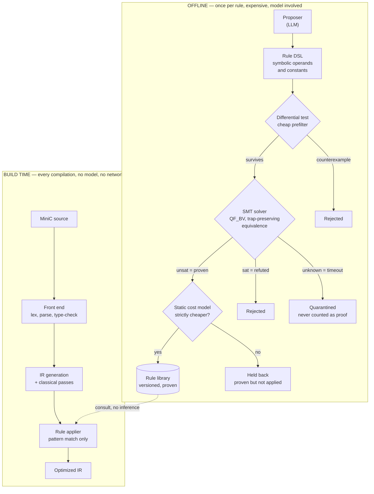
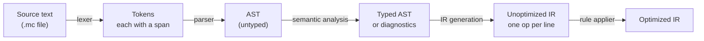
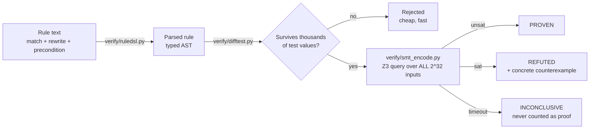
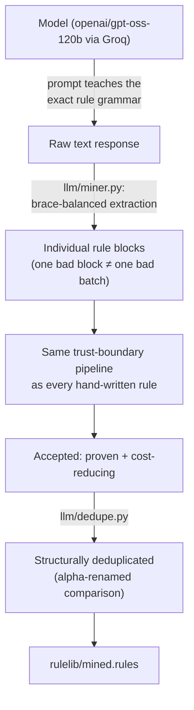

# Architecture

This document explains what ProveIt-C is, why it's shaped the way it is, and how its pieces fit together. For measured results and current build status, see [README.md](README.md). For the research framing and literature positioning, see [paper/paper.pdf](paper/paper.pdf). For how the code *inside* each piece actually works — function by function, in plain language — see [docs/](docs/README.md). For how to run and demo the project, see [PRESENTING.md](PRESENTING.md).

## The problem in one sentence

A compiler that lets an AI model propose optimizations needs a way to guarantee the AI never makes the program wrong — and it needs that guarantee to not depend on trusting the AI, testing a sample of inputs, or hoping.

## The core idea: a trust boundary

Every rewrite a model proposes is treated as an **untrusted claim** until a separate, deterministic system proves it. Nothing that hasn't been proven ever touches a real program.



The two halves never overlap. **Proving** is expensive, offline, and involves a model. **Applying** is a pattern match against an already-proven library — deterministic, fast, and reproducible: compiling the same program twice against the same library version produces byte-identical output.

## Why this specific design

Two costs show up in every published "LLM + verifier" compiler system, and this project exists to attack both:

1. **The checker runs out of road.** Real compiler IR (like LLVM IR) inherits C's undefined behavior, which makes formal verification *bounded* rather than total — some fraction of real programs simply can't be checked, and papers in this space report needing runtime fallback mechanisms to cover the gap.
2. **The model stays in the build.** If a model runs at every compilation, the build is slow, non-reproducible, and depends on network access.

**The fix for (1):** MiniC, a small language *designed* to be fully verifiable. Every operation either wraps (arithmetic) or traps (division by zero, out-of-range shifts, out-of-bounds array access) — nothing is undefined. That makes equivalence checking total instead of bounded.

**The fix for (2):** rules are proven with *symbolic* operands and constants, so one proof covers every instance of a pattern forever. The proposer runs once, offline, per rule — never during a build.

## Repository map

```
spec/         MiniC grammar (machine-checked LL(1)) and frozen formal semantics       → docs/01, docs/02
frontend/     Lexer → parser → AST → semantic analysis → structured diagnostics       → docs/01, docs/02
ir/           The intermediate representation: types, printer, parser, IR generation  → docs/03
passes/       Constant folding, trap-safe DCE, the rule applier + cost model          → docs/04
verify/       Rule DSL, SMT encoder, reference interpreter, differential tester       → docs/05, docs/06, docs/07
llm/          Module B: the live proposer — Groq client, prompt, miner, dedup         → docs/08
rulelib/      textbook (hand-written, proven) · adversarial (deliberately wrong, for testing
              the checker) · stealth (wrong-but-hard-to-catch) · hard (solver capability
              boundary) · mined (Module B's live output, kept separate for provenance) → docs/05, docs/08
bench/        Sample MiniC programs used as the benchmark suite
demo/         Terminal walkthrough script + its two sample programs                    → PRESENTING.md
experiments/  One script per measured result; regenerates every number in the paper   → docs/09
tests/        Pytest suite — every test asserts a concrete threshold, not "didn't crash" → docs/09
web/          Local playground (server.py + app.html) and the published status page   → docs/10
paper/        The IEEE-format research paper (paper.tex / paper.pdf)
```

Every arrow points into [docs/](docs/README.md), which explains the logic inside each of these directories function by function.

## Data flow: compiling one program



- **Lexer** (`frontend/lexer.py`): text → tokens, each tagged with an exact `line:col` span.
- **Parser** (`frontend/parser.py`): tokens → AST, a hand-written recursive-descent parser over a grammar proven conflict-free LL(1) (`spec/grammar.py`).
- **Semantic analysis** (`frontend/sema.py`): walks the AST, assigns a type to every expression, and either succeeds or produces structured diagnostics (span + expected/found types + in-scope symbols) — the exact substrate a future model-based repair loop (Module A) would consume.
- **IR generation** (`ir/irgen.py`): typed AST → a simple three-address IR, mechanically, with no optimization.
- **Rule applier** (`passes/peephole.py`): pattern-matches the IR against the proven rule library and rewrites in place. No model, no network, no randomness — deterministic by construction.

## Data flow: proving one rule



The obligation the solver actually proves is **trap-preserving equivalence**: the original and the rewrite must trap on exactly the same inputs, and agree on every value where neither traps. This is strictly stronger than "same output" — a rewrite that's numerically correct everywhere but silently removes a possible trap is still rejected.

## Module B: where the model actually sits



The model never touches a real program directly. It proposes *rules*, in the same DSL a human would write them in, and every proposal goes through the identical parse → differential-test → SMT pipeline as everything else in `rulelib/`. This is what "the AI proposes, the verifier decides" means concretely: the model's entire influence on the compiler is mediated by a step that can — and regularly does — say no.

## What's real vs. designed-but-not-built

See the status table in [README.md](README.md#status) for the current, measured breakdown. In short: the front end, verification core, and rule application machinery are complete and tested. Module B (the live proposer) is wired up and has produced real, measured results. The native backend, SSA construction, pass-ordering (Module C), and Module A's model-driven repair loop are not yet built.
